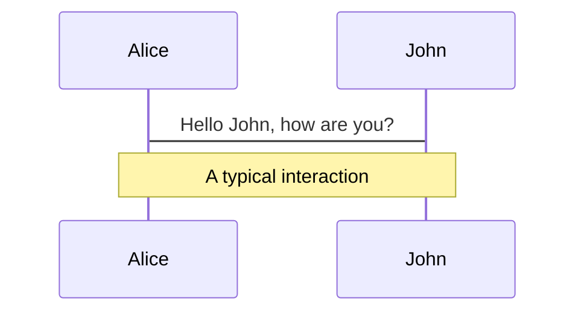
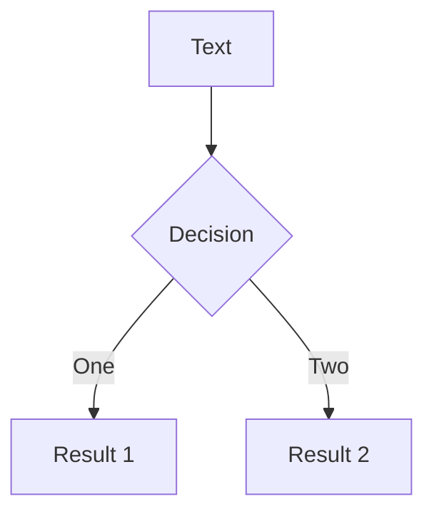
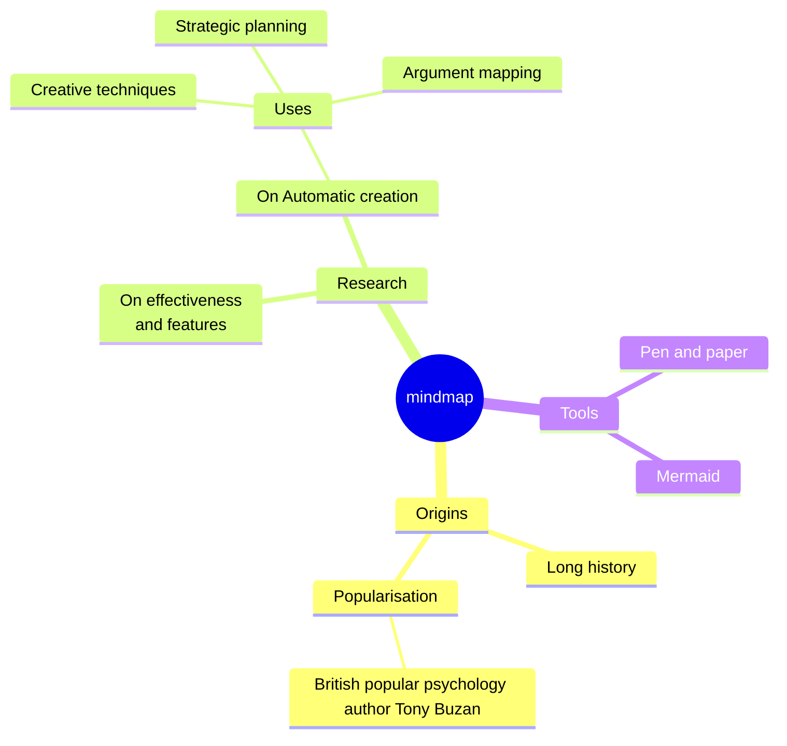
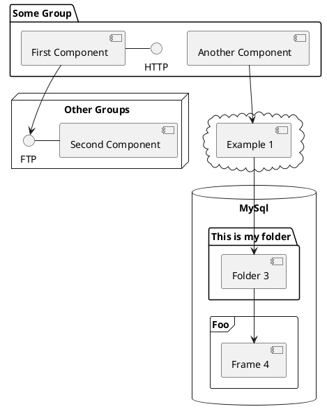

---
# You can also start simply with 'default'
theme: default
# random image from a curated Unsplash collection by Anthony
# like them? see https://unsplash.com/collections/94734566/slidev
background: https://cover.sli.dev
# some information about your slides (markdown enabled)
title: Welcome to Slidev
info: |
  ## Slidev Starter Template
  Presentation slides for developers.

  Learn more at [Sli.dev](https://sli.dev)
# apply unocss classes to the current slide
class: text-center
# https://sli.dev/features/drawing
drawings:
  persist: false
# slide transition: https://sli.dev/guide/animations.html#slide-transitions
transition: slide-left
# enable MDC Syntax: https://sli.dev/features/mdc
mdc: true
---

# 二三類跨領域分享

<div class="mt-12 py-1" color="white op-80" font-size="2xl">Speaker: 陳立倫</div> 
<!-- <div @click="$slidev.nav.next" class="mt-12 py-1" hover:bg="white op-10">
  Press Space for next page <carbon:arrow-right />
</div> -->


<!--
The last comment block of each slide will be treated as slide notes. It will be visible and editable in Presenter Mode along with the slide. [Read more in the docs](https://sli.dev/guide/syntax.html#notes)
-->

---
transition: slide-up
layout: two-cols
layoutClass: gap-10
---

# About me 

<!-- -[foo]: http://example.com/  "Optional Title Here" -->

  <div mt-8>
    <p>📝 -  台大生化科技系學士</p>
    <p>🧑‍🎓 -  台大分子醫學研究所碩士</p>
    <div mt-10>-  工作場所、時間受限</div>
    <div mt-2>-  研究投入時間成本高</div>
    <div class="flex flex-col justify-between items-center text-center flex-1" > 
      <div class="flex items-center justify-center">
        
      </div>
      <div  color="gray-500 op-90">Before</div>
    </div>
      <!-- <arrow v-click="1" x1="420" y1="320" x2="600" y2="320" color="#953" width="2" arrowSize="1"   :style="{ transition: 'opacity 0.3s ease-in-out', opacity: $slidev.nav.clicks >= 1 ? 0.8 : 0 }"
      /> -->
  </div>

::right::

  <div pt-13 v-click="1" class="border-l h-full pl-12 border-gray-400" 
      :style="{ transition: 'opacity 0.3s ease-in-out', opacity: $slidev.nav.clicks >= 1 ? 1 : 0 }
    ">
    <p>🖥️ - 自學程式</p>
    <p>🧑‍💻 - 現任外商軟體工程師</p>
    <div mt-10>-  工作地點、時間彈性</div>
    <div mt-2>-  待遇天花板高</div>
     <div  mt-1 class="flex flex-col justify-between items-center text-center" > 
      
      <div mt-3 color="gray-500 op-90">After</div>
    </div>
  </div>

<!--
You can have `style` tag in markdown to override the style for the current page.
Learn more: https://sli.dev/features/slide-scope-style
-->

<style>
h1 {
  background-color: #2B90B6;
  background-image: linear-gradient(45deg, #4EC5D4 10%, #146b8c 20%);
  background-size: 100%;
  -webkit-background-clip: text;
  -moz-background-clip: text;
  -webkit-text-fill-color: transparent;
  -moz-text-fill-color: transparent;
}
</style>

---
transition: slide-up
level: 2
---

# 二三類跨領域核心能力


<div mt-20 class="flex items-center ">

  <div  border-r border-gray-400 class="flex flex-col justify-between items-center text-center w-1/2" width="5"> 
      
      <div mt-3 text-2xl  color="gray-500 op-90">學界</div>
  </div>

  <div class="flex flex-col justify-between items-center text-center  w-1/2" > 
      
      <div mt-3 text-2xl color="gray-500 op-90">業界</div>
  </div>

</div>

<style>
h1 {
  background-color: #2B90B6;
  background-image: linear-gradient(45deg, #4EC5D4 10%, #146b8c 20%);
  background-size: 100%;
  -webkit-background-clip: text;
  -moz-background-clip: text;
  -webkit-text-fill-color: transparent;
  -moz-text-fill-color: transparent;
}
</style>

---
transition: slide-up
level: 2
---

# 二三類跨領域核心能力 - 學界

<ul mt-12 class=" list-disc text-2xl text-gray-800 pl-6 space-y-2">
  <li >科學方法</li>
  <!-- <li>第二點</li>
  <ul class="list-[circle] text-gray-500 pl-6">
    <li>子項目 1</li>
    <li>子項目 2</li>
  </ul> -->
</ul>

<div class="flow-chart">
  <div class="flow-item" >
    <div class="icon">🔍</div>
    <div class="text">觀察</div>
  </div>
  <div class="arrow" >→</div>
  <div class="flow-item" :class="{ 'active': $slidev.nav.clicks >= 1 }">
    <div class="icon">❓</div>
    <div class="text">提出問題</div>
  </div>
  <div class="arrow">→</div>
  <div class="flow-item" :class="{ 'active': $slidev.nav.clicks >= 2 }">
    <div class="icon">📚</div>
    <div class="text">参考文獻</div>
  </div>
  <div class="arrow">→</div>
  <div class="flow-item" :class="{ 'active': $slidev.nav.clicks >= 3 }">
    <div class="icon">💡</div>
    <div class="text">假設</div>
  </div>
  <div class="arrow" >→</div>
  <div class="flow-item" :class="{ 'active': $slidev.nav.clicks >= 4 }">
    <div class="icon">🧪</div>
    <div class="text">實驗</div>
  </div>
  <div class="arrow" >→</div>
  <div class="flow-item" :class="{ 'active': $slidev.nav.clicks >= 5 }">
    <div class="icon">📊</div>
    <div class="text">結論</div>
  </div>
</div>

<style>
.flow-chart {
  display: flex;
  justify-content: center;
  align-items: center;
  flex-wrap: wrap;
  margin: 2rem;
}

.flow-item {
  display: flex;
  flex-direction: column;
  align-items: center;
  padding: 1rem;
  margin: 0.5rem;
  border-radius: 8px;
  background: rgba(255, 255, 255, 0.1);
  /* backdrop-filter: blur(10px);
  transition: all 0.5s ease;
  opacity: 0.5;
  transform: scale(0.9); */
   opacity: 1;
  transform: scale(1);
  background: rgba(255, 255, 255, 0.2);
  /* box-shadow: 0 4px 12px rgba(0, 0, 0, 0.1); */
}

.flow-item.active {
  opacity: 1;
  transform: scale(1);
  background: rgba(255, 255, 255, 0.2);
  box-shadow: 0 4px 12px rgba(0, 0, 0, 0.1);
}

.icon {
  font-size: 2rem;
  margin-bottom: 0.5rem;
}

.text {
  font-weight: bold;
}

.arrow {
  font-size: 1.5rem;
  margin: 0 0.5rem;
  opacity: 0.3;
  transition: all 0.5s ease;
}

.arrow.active {
  opacity: 1;
  color: #3b82f6;
}

@media (max-width: 768px) {
  .flow-chart {
    flex-direction: column;
  }
  
  .arrow {
    transform: rotate(90deg);
    margin: 0.5rem 0;
  }
}

h1 {
  background-color: #2B90B6;
  background-image: linear-gradient(45deg, #4EC5D4 10%, #146b8c 20%);
  background-size: 100%;
  -webkit-background-clip: text;
  -moz-background-clip: text;
  -webkit-text-fill-color: transparent;
  -moz-text-fill-color: transparent;
}
</style>

---
transition: slide-up
level: 2
---

# 二三類跨領域核心能力 - 業界

<ul mt-12 class=" list-disc text-2xl text-gray-800 pl-6 space-y-2">
  <li >專業能力</li>
  <li>發現解決提出問題能力</li>
  <li>溝通表達能力</li>
  <li>尋找資源能力</li>
  <li>學習能力</li>
  <!-- <ul class="list-[circle] text-gray-500 pl-6">
    <li>子項目 1</li>
    <li>子項目 2</li>
  </ul> -->
</ul>


<style>
h1 {
  background-color: #2B90B6;
  background-image: linear-gradient(45deg, #4EC5D4 10%, #146b8c 20%);
  background-size: 100%;
  -webkit-background-clip: text;
  -moz-background-clip: text;
  -webkit-text-fill-color: transparent;
  -moz-text-fill-color: transparent;
}
</style>

<!--
Notes can also sync with clicks

[click] This will be highlighted after the first click

[click] Highlighted with `count = ref(0)`

[click:3] Last click (skip two clicks)
-->

---
# layout: center
# class: text-center
transition: slide-up
level: 2
---

# 二三類跨領域核心能力 - 應用

<div class="venn-container">
  <div class="venn-circle biology">
    <div class="label">生物</div>
  </div>
  <div class="venn-circle programming">
    <div class="label">程式</div>
  </div>
  <div class="intersection">
    <div class="intersection-label">生物資訊</div>
  </div>
</div>

<!-- <div class="grid grid-cols-2 gap-12"> -->
  <div class="bg-purple-100 dark:bg-purple-800 p-6 rounded-lg shadow-lg">
    <h3 class="text-xl font-bold mb-4">應用</h3>
    <ul class="space-y-2">
      <li>基因组分析</li>
      <li>蛋白质结构预测</li>
      <li>药物设计</li>
      <li>疾病诊断</li>
    </ul>
  </div>
<!-- </div> -->

<style>
h1 {
  background-color: #2B90B6;
  background-image: linear-gradient(45deg, #4EC5D4 10%, #146b8c 20%);
  background-size: 100%;
  -webkit-background-clip: text;
  -moz-background-clip: text;
  -webkit-text-fill-color: transparent;
  -moz-text-fill-color: transparent;
}

.venn-container {
  position: relative;
  width: 600px;
  height: 400px;
  margin: 0 auto;
}

.venn-circle {
  position: absolute;
  width: 280px;
  height: 280px;
  border-radius: 50%;
  display: flex;
  justify-content: center;
  align-items: center;
  opacity: 0.7;
  transition: all 0.3s ease;
}

.venn-circle:hover {
  opacity: 0.9;
  transform: scale(1.05);
}

.biology {
  left: 80px;
  background-color: rgba(46, 204, 113, 0.6);
  border: 2px solid rgba(46, 204, 113, 1);
}

.programming {
  right: 80px;
  background-color: rgba(52, 152, 219, 0.6);
  border: 2px solid rgba(52, 152, 219, 1);
}

.label {
  font-size: 24px;
  font-weight: bold;
  color: white;
  text-shadow: 1px 1px 2px rgba(0, 0, 0, 0.5);
}

.biology .label {
  transform: translateX(-40px);
}

.programming .label {
  transform: translateX(40px);
}

.intersection {
  position: absolute;
  width: 150px;
  height: 80px;
  top: 40%;
  left: 50%;
  transform: translate(-50%, -50%);
  display: flex;
  justify-content: center;
  align-items: center;
  z-index: 10;
}

.intersection-label {
  font-size: 20px;
  font-weight: bold;
  color: white;
  background-color: rgba(142, 68, 173, 0.8);
  padding: 8px 16px;
  border-radius: 20px;
  text-shadow: 1px 1px 2px rgba(0, 0, 0, 0.5);
  box-shadow: 0 4px 6px rgba(0, 0, 0, 0.1);
  &::after {
    content: "";
    position: absolute;
    top: 100%;
    left: 50%;
    transform: translateX(-50%);
    border-top: 10px solid rgba(142, 68, 173, 0.8);
    border-left: 10px solid transparent;
    border-right: 10px solid transparent;
  }
}
</style>

---
layout: two-cols
---

# 生物領域
- 分子生物学
- 遗传学
- 细胞生物学
- 微生物学
- 演化生物学

::right::

# 程式領域
- 算法设计
- 数据结构
- 软件工程
- 编程语言
- 人工智能


---

# 跨領域心得

<ul mt-12 class=" list-disc text-2xl text-gray-800 pl-6 space-y-2">
  <li >按部就班</li>
  <ul class="list-[circle] text-xl text-gray-500 pl-6">
    <li>不要為了跨而跨 剛上大學連自己的領域都還不熟悉 按部就本的來 本質上還是追尋自己想要的 我的跨領域只是結果</li>
    <li>子項目 2</li>
  </ul>
  <li>自己的技能或是專長也是廣義的跨領域</li>
  <li>累積和轉化自己的經驗能力，應用在跨領域上，過去的經驗沒有白費</li>
  <li>別人的策略不一定能套用在自己身上，走出自己的路</li>
</ul>


<style>
h1 {
  background-color: #2B90B6;
  background-image: linear-gradient(45deg, #4EC5D4 10%, #146b8c 20%);
  background-size: 100%;
  -webkit-background-clip: text;
  -moz-background-clip: text;
  -webkit-text-fill-color: transparent;
  -moz-text-fill-color: transparent;
}
</style>
<!--
Presenter note with **bold**, *italic*, and ~~striked~~ text.

Also, HTML elements are valid:
<div class="flex w-full">
  <span style="flex-grow: 1;">Left content</span>
  <span>Right content</span>
</div>
-->

---


# 結語

<div m="t-4" class="text-3xl font-bold text-center"> 你想成為什麼樣的人？</div>

<div grid="~ cols-2 gap-2" m="t-10">


  

  

</div>

Read more about [How to use a theme](https://sli.dev/guide/theme-addon#use-theme) and
check out the [Awesome Themes Gallery](https://sli.dev/resources/theme-gallery).

---

# Clicks Animations

You can add `v-click` to elements to add a click animation.

<div v-click>

This shows up when you click the slide:

```html
<div v-click>This shows up when you click the slide.</div>
```

</div>

<br>

<v-click>

The <span v-mark.red="3"><code>v-mark</code> directive</span>
also allows you to add
<span v-mark.circle.orange="4">inline marks</span>
, powered by [Rough Notation](https://roughnotation.com/):

```html
<span v-mark.underline.orange>inline markers</span>
```

</v-click>

<div mt-20 v-click>

[Learn more](https://sli.dev/guide/animations#click-animation)

</div>

---

# Motions

Motion animations are powered by [@vueuse/motion](https://motion.vueuse.org/), triggered by `v-motion` directive.

```html
<div
  v-motion
  :initial="{ x: -80 }"
  :enter="{ x: 0 }"
  :click-3="{ x: 80 }"
  :leave="{ x: 1000 }"
>
  Slidev
</div>
```

<div class="w-60 relative">
  <div class="relative w-40 h-40">
    
    
    
  </div>

  <div
    class="text-5xl absolute top-14 left-40 text-[#2B90B6] -z-1"
    v-motion
    :initial="{ x: -80, opacity: 0}"
    :enter="{ x: 0, opacity: 1, transition: { delay: 2000, duration: 1000 } }">
    Slidev
  </div>
</div>

<!-- vue script setup scripts can be directly used in markdown, and will only affects current page -->
<script setup lang="ts">
const final = {
  x: 0,
  y: 0,
  rotate: 0,
  scale: 1,
  transition: {
    type: 'spring',
    damping: 10,
    stiffness: 20,
    mass: 2
  }
}
</script>

<div
  v-motion
  :initial="{ x:35, y: 30, opacity: 0}"
  :enter="{ y: 0, opacity: 1, transition: { delay: 3500 } }">

[Learn more](https://sli.dev/guide/animations.html#motion)

</div>

---

# LaTeX

LaTeX is supported out-of-box. Powered by [KaTeX](https://katex.org/).

<div h-3 />

Inline $\sqrt{3x-1}+(1+x)^2$

Block

$$
{1|3|all}
\begin{aligned}
\nabla \cdot \vec{E} &= \frac{\rho}{\varepsilon_0} \\
\nabla \cdot \vec{B} &= 0 \\
\nabla \times \vec{E} &= -\frac{\partial\vec{B}}{\partial t} \\
\nabla \times \vec{B} &= \mu_0\vec{J} + \mu_0\varepsilon_0\frac{\partial\vec{E}}{\partial t}
\end{aligned}
$$

[Learn more](https://sli.dev/features/latex)

---

# Diagrams

You can create diagrams / graphs from textual descriptions, directly in your Markdown.

<div class="grid grid-cols-4 gap-5 pt-4 -mb-6">









</div>

Learn more: [Mermaid Diagrams](https://sli.dev/features/mermaid) and [PlantUML Diagrams](https://sli.dev/features/plantuml)

---

foo: bar
dragPos:
square: 691,32,167,\_,-16

---

dragPos:
square: -37,0,0,0

---
dragPos:
  square: -37,0,0,0
---

# Draggable Elements

Double-click on the draggable elements to edit their positions.

<br>

###### Directive Usage

```md

```

<br>

###### Component Usage

```md
<v-drag text-3xl>
  <div class="i-carbon:arrow-up" />
  Use the `v-drag` component to have a draggable container!
</v-drag>
```

<v-drag pos="522,101,261,_,-15">
  <div text-center text-3xl border border-main rounded>
    Double-click me!
  </div>
</v-drag>


###### Draggable Arrow

```md
<v-drag-arrow two-way />
```

<v-drag-arrow pos="300,365,-181,29" two-way op70 />

---

src: ./pages/imported-slides.md
hide: false

---


---

# Monaco Editor

Slidev provides built-in Monaco Editor support.

Add `{monaco}` to the code block to turn it into an editor:

```ts {monaco}
import { ref } from 'vue'
import { emptyArray } from './external'

const arr = ref(emptyArray(10))
```

Use `{monaco-run}` to create an editor that can execute the code directly in the slide:

```ts {monaco-run}
import { version } from 'vue'
import { emptyArray, sayHello } from './external'

sayHello()
console.log(`vue ${version}`)
console.log(
  emptyArray<number>(10).reduce(
    (fib) => [...fib, fib.at(-1)! + fib.at(-2)!],
    [1, 1]
  )
)
```

---

layout: center
class: text-center

---

# Learn More

[Documentation](https://sli.dev) · [GitHub](https://github.com/slidevjs/slidev) · [Showcases](https://sli.dev/resources/showcases)

<PoweredBySlidev mt-10 />
